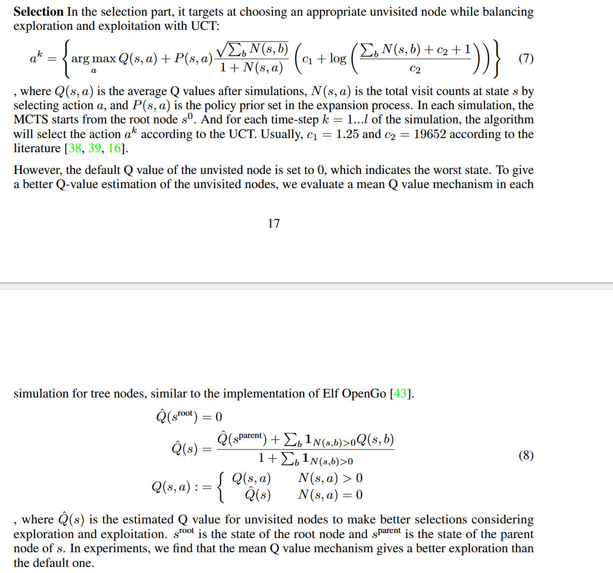
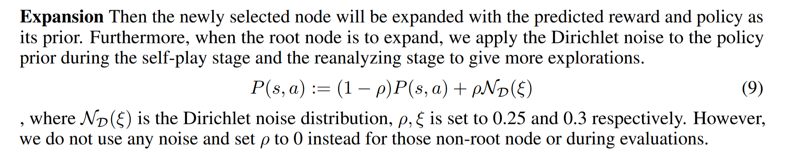
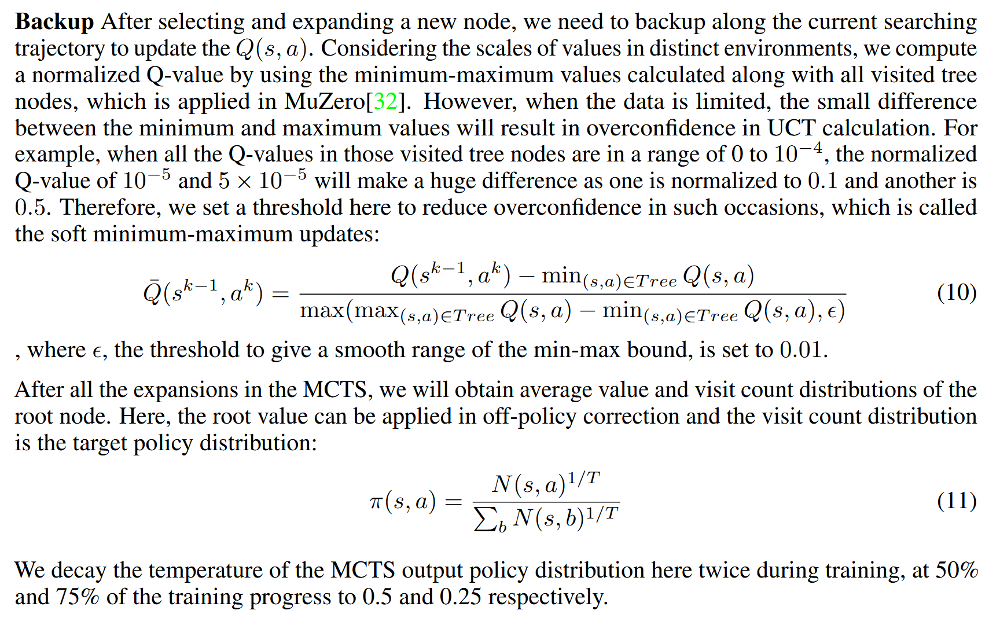

# Implment a python MCTS

put the code in [path](../src/atariagent/search/)

Default N(sim) = 50

Here're the tree stage.

## Selection

reference 

## Expansion

reference 

## Backup

reference 

you should also check the [Code](../../EfficientZero/)

## Validation

after you finish, you should write a test to validation MCTS with random policy and default value network.

another important tips is we using value prefix not reward in current implementation.

